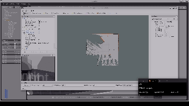

# NavRover

NavRover is a ROS-based autonomous rover project aimed at advanced navigation and mapping, developed as part of Buildspace's Nights & Weekends program S5. This project integrates a 4-wheeled rocker mechanism for stable navigation and includes various ROS packages for simulation, teleoperation, and autonomous navigation. This project is based on my final year engineering project.

## Table of Contents

- [Introduction](#introduction)
- [Features](#features)
- [Getting Started](#getting-started)
  - [Prerequisites](#prerequisites)
  - [Installing ROS Noetic & Necessary Packages](#installing-ros-noetic--necessary-packages)
  - [Installation](#installation)
- [Usage](#usage)
  - [Simulation & Teleoperation](#simulation--teleoperation)
  - [Navigation](#navigation)
- [Architecture](#architecture)
- [Contributing](#contributing)
- [License](#license)
- [Acknowledgements](#acknowledgements)

## Introduction

NavRover is a versatile rover designed to perform autonomous navigation and mapping. It leverages ROS Noetic to provide robust simulation and teleoperation capabilities, making it an ideal platform for robotics students and enthusiasts. This project is an extension of my final year engineering project, further developed through Buildspace's Nights & Weekends program S5.

## Project Showcase

### CAD Model


### 2D Mapping Process


### Autonomous Navigation


## Features

- **4-Wheeled Rocker Mechanism**: Ensures stability on uneven terrains.
- **ROS Noetic Compatibility**: Utilizes the latest ROS features.
- **Autonomous Navigation**: Implements the DWA planner/Trajectory planner for efficient path planning.
- **2D Mapping and Navigation**: Generates and navigates detailed 2D maps using sensor data.
- **Teleoperation**: Allows remote control via *teleop_twist_keyboard* node.
- **Simulation**: Complete simulation capabilities using Gazebo.

*Note: 3D mapping and navigation features are currently under development.*

## Getting Started

### Prerequisites

Ensure you have the following installed:

- ROS Noetic
- Ubuntu 20.04
- Python 3.8+
- Git

### Installing ROS Noetic & Necessary Packages

Please refer to this [YouTube video](https://youtu.be/x5MhydijWmc?si=WYQ-wIAWBsNOwxfo) on installing Ubuntu 20.04 and Virtual Box.  
Please refer to this [YouTube video](https://youtu.be/ZA7u2XPmnlo?si=0cQu7ZOh-GIMOnjV) on installing ROS Noetic.  
Please refer to this [YouTube video](https://youtu.be/Jbyb0kQXhJU?si=8C96k2CQqmoKXb9S) on installing the necessary packages and setting up this project.  


### Installation

1. Clone the repository:

    ```bash
    git clone https://github.com/jj7258/NavRover.git
    cd NavRover
    ```

2. Install dependencies:

    ```bash
    rosdep install --from-paths src --ignore-src -r -y
    ```

3. Build the workspace:

    ```bash
    catkin_make
    source devel/setup.bash
    ```

## Usage

### Simulation & Teleoperation

1. Launch the simulation environment:

    ```bash
    roslaunch navrover_simulation gazebo.launch
    ```

2. Launch the teleoperation node:

    ```bash
    rosrun teleop_twist_keyboard teleop_twist_keyboard.py
    ```

3. Use the keyboard to control the rover.

### Navigation

1. Launch the simulation environment:

    ```bash
    roslaunch navrover_simulation gazebo.launch
    ```

2. Launch the navigation stack:

    ```bash
    roslaunch navrover_navigation navigation.launch
    ```

3. Launch the teleoperation node:

    ```bash
    rosrun teleop_twist_keyboard teleop_twist_keyboard.py
    ```

4. Set the initial pose using **2D Initial Pose** in Rviz.
5. Drive the rover around until it gets localized ( the AMCL arrows become concentrated).
6. Set the navigation goal using **2D Nav Goal** in Rviz.

## Architecture

NavRover consists of several packages, each with a specific role:

- **navrover_description**: URDF and Xacro files for the rover model and Gazebo models.
- **navrover_navigation**: Navigation stack and configurations.

## Contributing

Contributions are welcome! Follow these steps:

1. Fork the repository.
2. Create a new branch:

    ```bash
    git checkout -b feature/your-feature
    ```

3. Make your changes and commit them:

    ```bash
    git commit -m "Add your feature"
    ```

4. Push to the branch:

    ```bash
    git push origin feature/your-feature
    ```

5. Open a pull request.

## License

This project is licensed under the GPL-3.0 License - see the [LICENSE](LICENSE) file for details.

## Acknowledgements

- [Jerin Peter](https://github.com/jerinpeter)
- [Leo Rover](https://www.leorover.tech/)
- [Turtlebot](https://github.com/turtlebot/turtlebot)
- Buildspace's Nights & Weekends program
- ROS community
- Open-source contributors
