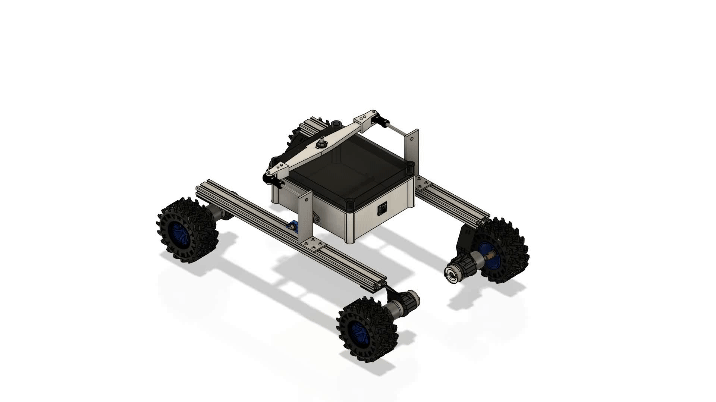

# NavRover

NavRover is a ROS-based autonomous rover project aimed at advanced navigation and mapping, developed as part of Buildspace's Nights & Weekends program S5. This project integrates a 4-wheeled rocker mechanism for stable navigation and includes various ROS packages for simulation, teleoperation, and autonomous navigation. This project is based on my final year engineering project.

## Table of Contents

- [Introduction](#introduction)
- [Features](#features)
- [Future Scope](#future-scope)
- [Getting Started](#getting-started)
  - [Prerequisites](#prerequisites)
  - [Installing ROS Noetic & Necessary Packages](#installing-ros-noetic--necessary-packages)
  - [Installation](#installation)
- [Usage](#usage)
  - [Simulation & Teleoperation](#simulation--teleoperation)
  - [2D Mapping](#2d-mapping)
  - [2D Navigation](#2d-navigation)
  - [3D Mapping via OctoMap](#3d-mapping-via-octomap)
  - [3D Mapping via RTAB-Map](#3d-mapping-via-rtab-map)
  - [Navigation with RTAB-Map](#navigation-with-rtab-map)
- [Architecture](#architecture)
- [Contributing](#contributing)
- [License](#license)
- [Acknowledgements](#acknowledgements)

## Introduction

NavRover is a versatile rover designed to perform autonomous navigation and mapping. It leverages ROS Noetic to provide robust simulation and teleoperation capabilities, making it an ideal platform for robotics students and enthusiasts. This project is an extension of my final year engineering project, further developed through Buildspace's Nights & Weekends program S5.

## Project Showcase

### CAD Model



### 2D Mapping Process


### Autonomous Navigation


## Features

- **4-Wheeled Rocker Mechanism**: Ensures stability on uneven terrains.
- **ROS Noetic Compatibility**: Utilizes the latest ROS features.
- **Autonomous Navigation**: Implements the DWA planner/Trajectory planner for efficient path planning.
- **2D Mapping and Navigation**: Generates and navigates detailed 2D maps using sensor data.
- **Teleoperation**: Allows remote control via *teleop_twist_keyboard* node.
- **Simulation**: Complete simulation capabilities using Gazebo.
- **3D Mapping (OctoMap and Real-Time Appearance Based Mapping RTAB-Map)**: Generates and navigates detailed 3D maps using Kinect Sensor data.
- **Autonomous Navigation Based on 3D Maps**: 3D Maps are converted to detailed 2D Maps on which autonomous navigation will be performed.

## Future Scope

*NOTE: Would be implemented in any order, in the near future*

1. Implementation of Gaussian Splatting.
2. Implementation of custom depth/stereo-camera sensor.
3. Conversion to ROS2 Jazzy.

## Getting Started

### Prerequisites

Ensure you have the following installed:

- ROS Noetic
- Ubuntu 20.04
- Python 3.8+
- Git

### Installing ROS Noetic & Necessary Packages

Please refer to this [YouTube video](https://youtu.be/x5MhydijWmc?si=WYQ-wIAWBsNOwxfo) on installing Ubuntu 20.04 and Virtual Box.  
Please refer to this [YouTube video](https://youtu.be/ZA7u2XPmnlo?si=0cQu7ZOh-GIMOnjV) on installing ROS Noetic.  
Please refer to this [YouTube video](https://youtu.be/Jbyb0kQXhJU?si=8C96k2CQqmoKXb9S) on installing the necessary packages and setting up this project.  

*Note: Videos on setting up OctoMap and RTAB-Map will be added soon*

### Installation

1. Clone the repository:

    ```bash
    git clone https://github.com/jj7258/NavRover.git
    cd NavRover
    ```

2. Install dependencies:

    ```bash
    rosdep install --from-paths src --ignore-src -r -y
    ```

3. Build the workspace:

    ```bash
    catkin_make
    source devel/setup.bash
    ```

## Usage

### Simulation & Teleoperation

1. Launch the simulation environment:

    ```bash
    roslaunch navrover_gazebo nights_and_weekends_world.launch
    ```

2. Launch the teleoperation node:

    ```bash
    rosrun teleop_twist_keyboard teleop_twist_keyboard.py
    ```

3. Use the keyboard to control the rover.

### 2D Mapping

1. Launch the simulation environment and GMapping node together (By default it opens to gazebo.launch, the argument is _world:=_):

    ```bash
    roslaunch navrover_simulation 2d_mapping.launch
    ```

2. Launch the teleoperation node:

    ```bash
    rosrun teleop_twist_keyboard teleop_twist_keyboard.py
    ```

3. Use the keyboard to control the rover.

4. Run the following command in the next terminal to save the map in the HOME directory:

    ```bash
    rosrun map_server map_saver -f <map_name>
    ```

### 2D Navigation

1. Launch the simulation environment:

    ```bash
    roslaunch navrover_gazebo nights_and_weekends_world.launch
    ```

2. Launch the navigation stack (Launches the move_base.launch and amcl_plus_map_loader.launch file):

    ```bash
    roslaunch navrover_navigation navigation.launch
    ```

    *Note: To change the map, modify the map_loader.launch file, and ensure the .yaml file is present in the correct directory*

3. Launch the teleoperation node:

    ```bash
    rosrun teleop_twist_keyboard teleop_twist_keyboard.py
    ```

4. Set the initial pose using **2D Initial Pose** in Rviz.
5. Drive the rover around until it gets localized ( the AMCL arrows become concentrated).
6. Set the navigation goal using **2D Nav Goal** in Rviz.

### 3D Mapping via OctoMap

1. Launch the simulation environment and OctoMapping node:

    ```bash
    roslaunch navrover_simulation octomap.launch
    ```

2. Launch the teleoperation node:

    ```bash
    rosrun teleop_twist_keyboard teleop_twist_keyboard.py
    ```

3. Use the keyboard to control the rover.

4. Run the following command in the next terminal to save the map in the HOME directory:

    ```bash
    rosrun octomap_server octomap_saver -f <map_name>.ot 
    ```

    OR

    ```bash
    rosrun octomap_server octomap_saver <map_name>.bt 
    ```

    *NOTE: The first command saves the full probability octomap, whereas, the second one saves the compressed binary octomap*

### 3D Mapping via RTAB-Map

1. Launch the simulation environment:

    ```bash
    roslaunch navrover_gazebo nights_and_weekends_world.launch
    ```

2. Launch the RTAB-Map Mapping node with Rviz (To delete the database, add the following argument at the end _delete:=--delete_db_on_start_):

    ```bash
    roslaunch navrover_rtab_package rtabmap_mapping.launch
    ```

    OR

    Launch the RTAB-Map Mapping node with Rtabmap_viz(To delete the database, add the following argument at the end _delete:=--delete_db_on_start_):

    ```bash
    roslaunch navrover_rtab_package rtabmap.launch
    ```

3. Launch the teleoperation node:

    ```bash
    rosrun teleop_twist_keyboard teleop_twist_keyboard.py
    ```

4. Use the keyboard to control the rover.

### Navigation with RTAB-Map

1. Browse the data using the database viewer, to access it run the following command:
   
    ```bash
    rtabmap-databaseViewer ~/.ros/<database_name>.db
    ```
   **NOTE: By default it's rtabmap.db, but here in both rtabmap launch files it is gazebo.db, but you can change it accordingly.**
   
   *NOTE: RTAB-Map creates the .yaml and .png corresponding to the 3D map created when exported, these files are then used for performing normal autonomous navigation.*
    
1. Launch the simulation environment:

    ```bash
    roslaunch navrover_gazebo gazebo.launch
    ```

2. Launch the RTAB-Map-based 2D Nav launch file:

    ```bash
    roslaunch navrover_rtab_package rtabmap_2d_nav.launch
    ```

3. Launch the teleoperation node:

    ```bash
    rosrun teleop_twist_keyboard teleop_twist_keyboard.py
    ```

4. Set the initial pose using **2D Initial Pose** in Rviz.
5. Drive the rover around until it gets localized (the AMCL arrows become concentrated).
6. Set the navigation goal using **2D Nav Goal** in Rviz.

## Architecture

NavRover consists of several packages, each with a specific role:

- **navrover_control**: Control parameters for the rover's rocker arms.
- **navrover_description**: URDF and Xacro files for the rover.
- **navrover_gazebo**: Consists of different simulation worlds, models, and gazebo launch files.
- **navrover_navigation**: Navigation stack and configurations.
- **navrover_rtab_package**: RTAB-Map Launch files based on the rover's current configuration.
- **navrover_simulation**: Contains the single execution launch files for 2D Mapping, Octomapping. Furthermore, it also had the GMapping and display launch files, with the corresponding Rviz parameter files.
- **octomap_mapping_navrover**: Includes the octomap_mapping and octomap_server, necessary for mapping and saving the environment in octomap format.

## Contributing

Contributions are welcome! Follow these steps:

1. Fork the repository.
2. Create a new branch:

    ```bash
    git checkout -b feature/your-feature
    ```

3. Make your changes and commit them:

    ```bash
    git commit -m "Add your feature"
    ```

4. Push to the branch:

    ```bash
    git push origin feature/your-feature
    ```

5. Open a pull request.

## License

This project is licensed under the GPL-3.0 License - see the [LICENSE](LICENSE) file for details.

## Acknowledgements

- [Jerin Peter](https://github.com/jerinpeter)
- [Leo Rover](https://www.leorover.tech/)
- [Turtlebot](https://github.com/turtlebot/turtlebot)
- [Buildspace's Nights & Weekends program](https://buildspace.so/nw)
- [ROS community](https://discourse.ros.org/)
- Open-source contributors
